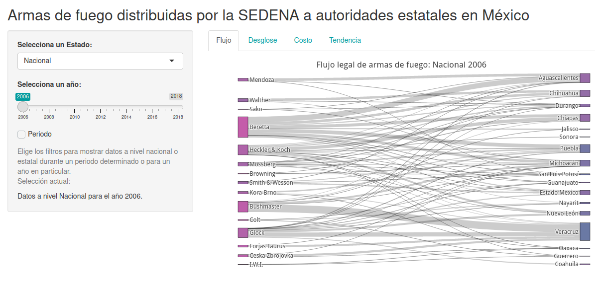

# Flujo legal de armas de fuego 


## ¿Qué es esto?

Código para generar una Shiny app en R que permite visualizar datos sobre transferencias legales de armas en México. Los datos aquí presentados fueron generados a partir de la revisión de facturas de transferencias de armas de fuego y municiones de la Secretaría de la Defensa Nacional (SEDENA) a las autoridades estatales durante el periodo 2006-2018. 




Se trata de documentación obtenida a través de la solicitud de información *#0000700176018*. La base de datos y la metodología con la que se contruyó se encuentran disponibles para descarga [aquí](https://www.stopusarmstomexico.org/police-firearms-database).
 


Para ver la app accede [aquí](https://daniel-mata.shinyapps.io/).
 
## Descarcar datos y limpiar base 

Para descargar y limpiar los datos necesitas clonar este repositorio, una vez clonado ingresar y ejecutar el script de descarga:

```sh
me@compu:~$  git clone git@github.com:ildanilo/armas-de-fuego-app.git

me@compu:~$ cd armas-de-fuego-app/

me@compu:~$ Rscript utils/DownloadAndCleanData.R 

```
## Configurar un ambiente Python para habilitar R reticulate 

Francamente resultó muy difícil hacer treemaps en Plotly usando R, creo que es más sencillo hacerlos usando Python. Por este motivo terminé usando R reticulate para hacer esta visualización. 
Para que funcione localmente es necesario configurar un ambiente dentro de este repostitorio usando virtualenv después de haberlo clonado.

```sh
me@compu:~$ sudo pip install virtualenv

me@compu:~$ virtualenv env

```
Una vez preparado el ambiente virtual, es necesario instalar Plotly para Python, para eso emplar el archivo requirements.txt

```sh
me@compu:~$ env/bin/pip install -r requirements.txt
```

Despues de estos pasos puedes correr la app en tu computadora.
